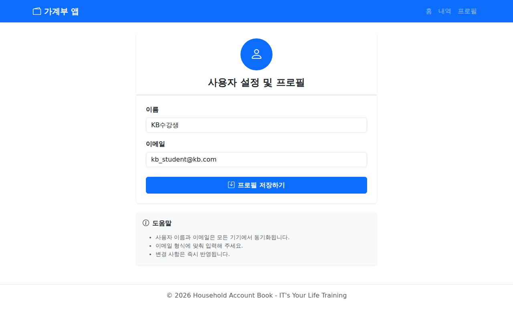

# 💰 가계부 서비스 앱 (Household Account Book App)

본 프로젝트는 **K-디지털 트레이닝 'IT's Your Life'** 과정의 수강생들을 위해 제작된 **가계부 서비스 애플리케이션 스켈레톤 프로젝트**입니다.
시니어 멘토의 관점에서 작성된 이 코드는 Vue 3의 현대적인 개발 방식과 프론트엔드 필수 생태계(Pinia, Router, Axios)를 한눈에 파악할 수 있도록 설계되었습니다.

---

## 📸 미리보기 (Screenshots)

<details>
<summary><b>📷 클릭하여 실행 화면 확인하기</b></summary>
<br>

| 1. 메인 대시보드 (Dashboard) | 2. 거래 내역 조회 (History) |
| :---: | :---: |
|  |  |
| **3. 거래 등록 및 수정 (Form)** | **4. 설정 및 프로필 (Profile)** |
|  |  |

</details>

---

## 🚀 시작 가이드 (How to Run)

초보 개발자분들도 따라 할 수 있도록 순서대로 설명합니다.

### 1. 필수 프로그램 설치
- **Node.js:** 공식 홈페이지에서 LTS 버전을 설치하세요.
- **Visual Studio Code:** 추천하는 코드 에디터입니다.

### 2. 프로젝트 내려받기 및 의존성 설치
터미널(또는 CMD)을 열고 아래 명령어를 입력하세요.
```bash
# 패키지 설치 (node_modules 폴더가 생성됩니다)
npm install
```

### 3. 백엔드(Mock API) 서버 실행
이 앱은 실제 서버 대신 `json-server`를 사용하여 데이터를 저장하고 불러옵니다. **터미널을 하나 더 열어서** 실행해 주세요.
```bash
# db.json 파일을 데이터베이스로 사용하는 서버를 3000포트에서 실행
npx json-server db.json --port 3000
```
> **Tip:** 서버가 켜져 있어야 데이터가 보이고 저장이 가능합니다!

### 4. 프론트엔드 개발 서버 실행
```bash
# Vite 개발 서버 실행
npm run dev
```
이제 터미널에 나타난 주소(예: `http://localhost:5173`)를 브라우저에서 열어보세요!

---

## 🛠 사용 기술 스택 (Tech Stack)

- **Vue 3:** 가장 현대적인 `Composition API` (`<script setup>`) 방식을 사용합니다.
- **Vite:** 빠르고 가벼운 차세대 빌드 도구입니다.
- **Pinia:** Vue의 공식 상태 관리 라이브러리로, 복잡한 데이터를 중앙에서 관리합니다.
- **Vue-Router:** 페이지 간 이동(라우팅)을 담당합니다.
- **Axios:** 백엔드 서버와 데이터를 주고받기 위한 HTTP 클라이언트입니다.
- **Bootstrap 5:** 깔끔하고 반응형인 UI를 빠르게 만들기 위한 스타일 프레임워크입니다.

---

## 📂 프로젝트 구조 (Project Structure)

```text
src/
├── api/          # 📡 API 통신 (Axios)
│   ├── index.js      # Axios 기본 설정
│   ├── budgetApi.js  # 거래 내역 관련 API
│   └── profileApi.js # 프로필 관련 API
├── store/        # 📦 상태 관리 (Pinia)
│   ├── budgetStore.js   # 돈의 흐름(데이터) 관리
│   └── profileStore.js  # 사용자 정보 관리
├── router/       # 🛣 페이지 경로 (Vue Router)
├── views/        # 🖥 주요 페이지 컴포넌트
│   ├── Home.vue            # 대시보드
│   ├── History.vue         # 내역 리스트
│   ├── TransactionForm.vue # 등록/수정 폼
│   └── Profile.vue         # 프로필 설정
├── App.vue       # 🏠 최상위 부모 컴포넌트 (네비게이션 포함)
└── main.js       # 🎬 앱의 시작점 (라이브러리 등록)
```

---

## 💡 주요 학습 포인트 (What We Learn)

수강생 여러분은 이 코드를 분석하며 다음 내용을 학습할 수 있습니다.

1.  **컴포넌트 중심 개발:** 기능을 단위별로 쪼개고 재사용하는 Vue의 핵심 철학을 배웁니다.
2.  **반응형 데이터 처리:** `ref`, `reactive`, `computed`를 사용하여 데이터 변화에 따라 화면이 자동으로 바뀌는 원리를 이해합니다.
3.  **중앙 집중식 상태 관리 (Pinia):** 왜 데이터를 한곳에서 관리해야 하는지, 여러 페이지에서 같은 데이터를 어떻게 공유하는지 학습합니다.
4.  **비동기 통신 (Async/Await):** `Axios`를 사용하여 서버에서 데이터를 가져오고 보내는 실제 현업 방식을 경험합니다.
5.  **REST API의 이해:** GET(조회), POST(생성), PUT(수정), DELETE(삭제)의 4대 기본 동작을 실습합니다.

---

### 👨‍🏫 멘토의 한마디
"코드를 단순히 복사하기보다는, 데이터가 **API -> Store -> View**로 어떻게 흘러가는지 흐름을 따라가 보세요. 이 흐름만 이해해도 프론트엔드 개발의 절반은 완성한 것입니다!"
