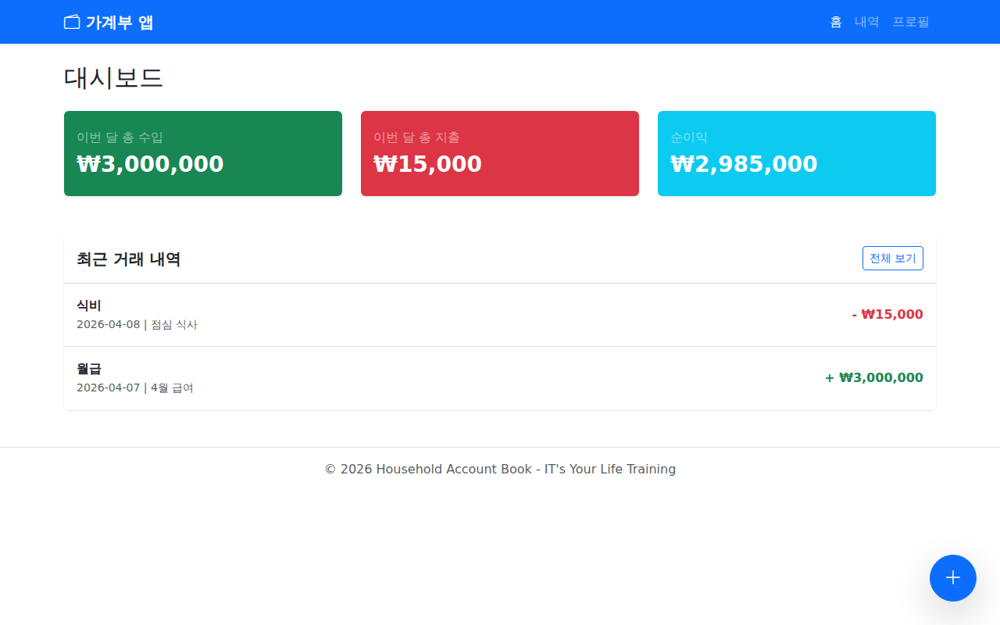
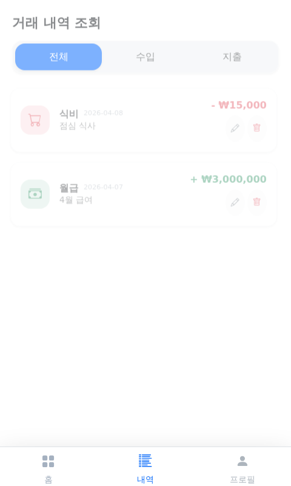
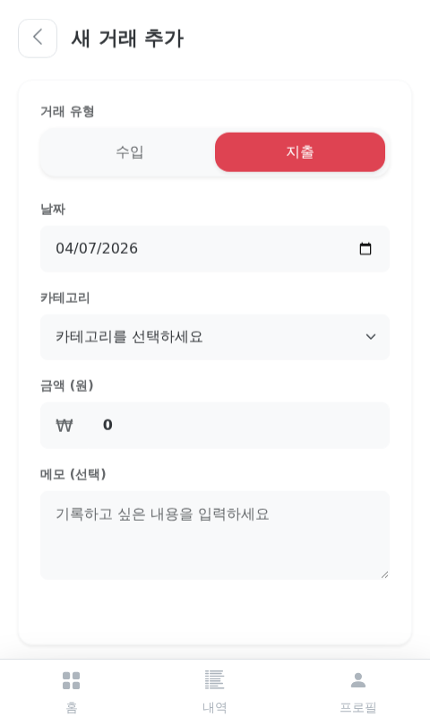
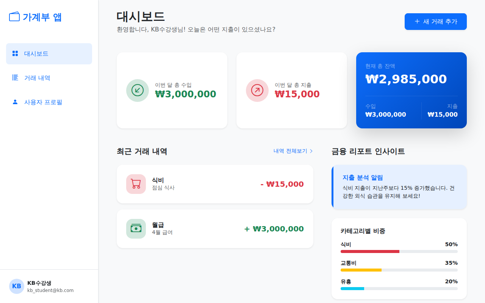

# 💰 가계부 서비스 앱 (Household Account Book App) - Final Phase (Responsive Web App)

본 프로젝트는 **K-디지털 트레이닝 'IT's Your Life'** 과정의 수강생들을 위해 제작된 **가계부 서비스 애플리케이션 스켈레톤 프로젝트**입니다.
최종 단계에서는 모바일을 넘어 태블릿과 PC 환경에서도 최적의 경험을 제공하는 **완벽한 반응형 웹앱(Responsive Web App)**으로 진화했습니다.

---

## 📸 미리보기 (Screenshots)

<details>
<summary><b>💻 모바일 & 데스크톱 반응형 디자인 확인하기</b></summary>
<br>

### 📱 Mobile UI (Bottom Navigation)
| 홈 대시보드 | 거래 내역 | 등록/수정 |
| :---: | :---: | :---: |
|  |  |  |

### 🖥 Desktop UI (Sidebar Navigation & Dashboard Grid)
데스크톱에서는 넓은 화면을 활용하여 사이드바와 다단 레이아웃(Grid)을 제공합니다.


</details>

---

## 🚀 시작 가이드 (How to Run)

```bash
# 1. 패키지 설치
npm install

# 2. 백엔드(Mock API) 서버 실행 (터미널 1)
npx json-server db.json --port 3000

# 3. 프론트엔드 개발 서버 실행 (터미널 2)
npm run dev
```

---

## 📂 프로젝트 구조 (Project Structure)

```text
src/
├── api/          # 📡 API 통신 (Axios)
├── store/        # 📦 상태 관리 (Pinia)
├── router/       # 🛣 페이지 경로 (Vue Router)
├── views/        # 🖥 반응형 화면 컴포넌트
│   ├── Home.vue            # 대시보드 (반응형 그리드 레이아웃)
│   ├── History.vue         # 내역 (Mobile List / Desktop Table 스위칭)
│   ├── TransactionForm.vue # 등록/수정 (모바일 폼 / 데스크톱 카드)
│   └── Profile.vue         # 프로필 (반응형 설정 페이지)
├── App.vue       # 🏠 반응형 레이아웃 래퍼 (Sidebar <-> Bottom Nav 전환)
└── main.js       # 🎬 앱 시작점
```

---

## 💡 학습 포인트 (What we learn)

본 최종 프로젝트를 통해 수강생들이 배울 수 있는 핵심 반응형 웹앱 개발 기법입니다.

### 1. Breakpoint 기반 레이아웃 분기 처리
- **Tailwind/Bootstrap 유틸리티:** `d-md-none`, `d-none d-md-flex` 등의 클래스를 사용하여 화면 크기에 따라 컴포넌트(Sidebar, Bottom Nav)를 지능적으로 노출/차단하는 방법.
- **Adaptive UI:** 모바일에서는 손쉬운 엄지손가락 조작을 위한 하단 네비게이션을, 데스크톱에서는 정보 접근성이 높은 사이드바를 제공하는 설계 전략.

### 2. 컨텐츠 구조의 동적 스위칭 (Dynamic Switching)
- **List vs Table:** 데이터의 양과 화면 너비에 따라 모바일에서는 **'리스트 타일'**, 데스크톱에서는 **'데이터 테이블'**로 UI를 전환하여 정보 밀도를 최적화하는 기법.
- **Form UI:** 모바일의 풀스크린 폼과 데스크톱의 중앙 정렬 카드 폼 간의 자연스러운 레이아웃 변환.

### 3. Responsive Grid & Flexbox 활용
- `row-cols`, `grid-cols` 등을 활용하여 1단(모바일)에서 3단(데스크톱)으로 변하는 유연한 대시보드 그리드 설계.
- `position-sticky`를 활용한 데스크톱 사이드바 고정 및 컨텐츠 스크롤 제어.

### 4. 컴포넌트 재사용 및 비즈니스 로직 분리
- 레이아웃이 변하더라도 내부의 데이터 바인딩과 비즈니스 로직(Pinia, API)은 동일하게 유지하는 **'로직과 뷰의 분리'** 원칙 체득.

---

### 👨‍🏫 멘토의 한마디
"진정한 실력은 **'어떤 기기에서도 아름답고 편리한 앱'**을 만드는 것에서 나옵니다. 반응형 유틸리티 클래스를 마스터하여 단 하나의 코드로 수백만 대의 기기를 지원하는 프론트엔드 전문가로 거듭나세요!"
